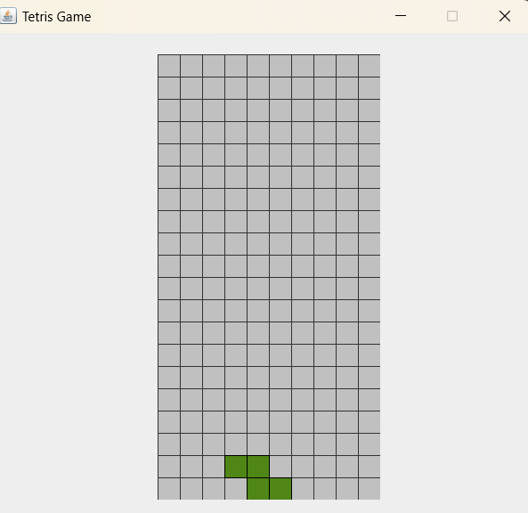
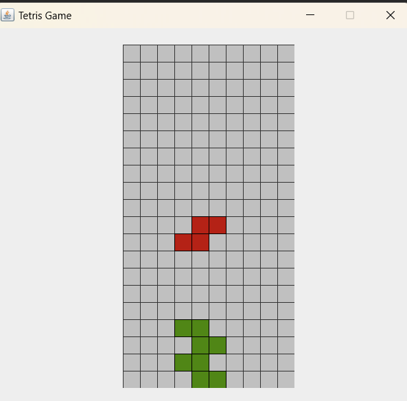
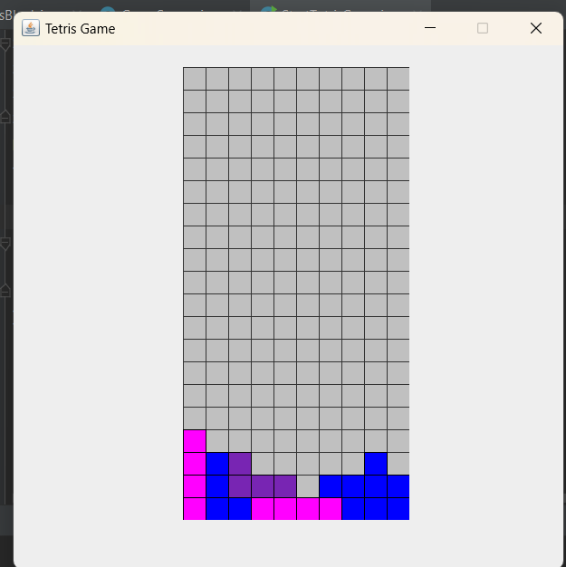
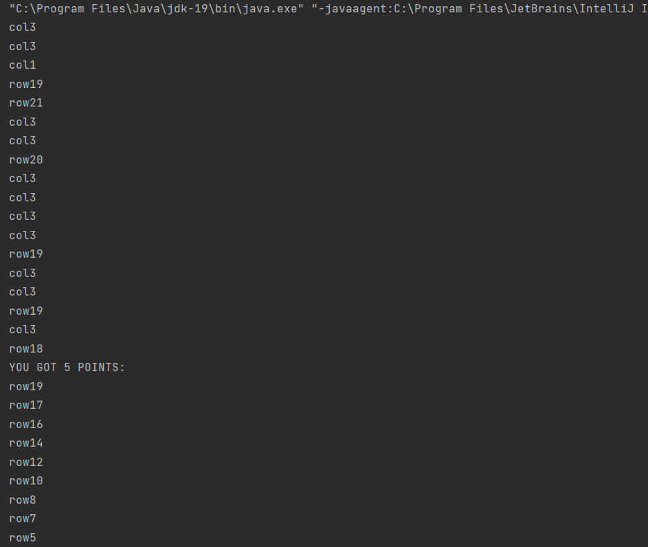
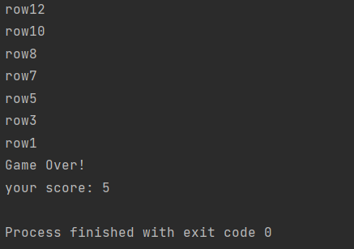
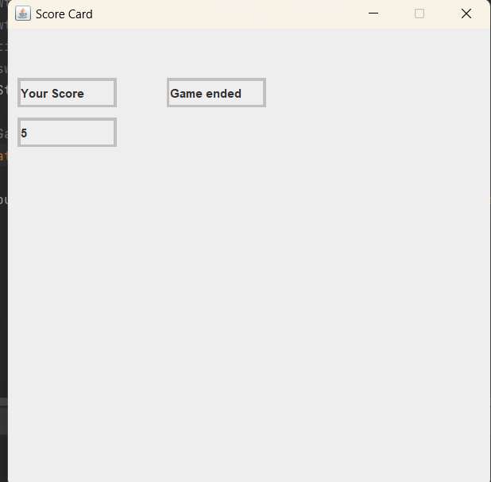

# Tetris_in_Java



## Overview
Welcome to the Tetris Game implemented in Java using Swing! This project is a classic Tetris game with a graphical interface, showcasing the use of Java for creating interactive and visually appealing games.

## Features
- **Classic Tetris Gameplay**: Enjoy the timeless Tetris game mechanics.
- **Intuitive Controls**: Use the arrow keys to move and rotate the Tetris blocks.
- **Score Tracking**: Keep track of your score as you clear rows.
- **Colorful Blocks**: Each block has a distinct color for easy identification.
- **Game Over Screen**: Displays your final score when the game ends.

## Installation
To run the Tetris game on your local machine, follow these steps:

1. **Clone the Repository**:
    ```bash
    git clone https://github.com/ayu-ano/tetris-game.git
    cd tetris-game
    ```

2. **Compile the Code**:
    ```bash
    javac StartTetrisGame.java
    ```

3. **Run the Game**:
    ```bash
    java StartTetrisGame
    ```

## Usage
- **Start the Game**: Launch the game using the instructions above.
- **Controls**:
    - **Right Arrow**: Move block right
    - **Left Arrow**: Move block left
    - **Up Arrow**: Rotate block
    - **Down Arrow**: Drop block

## Code Structure
- `TetrisBlock.java`: Defines the Tetris block properties and behaviors.
- `GameSource.java`: Contains the main game logic and panel for rendering the game.
- `StartTetrisGame.java`: Entry point to start the Tetris game.

## Screenshots
Include some screenshots to give users a visual representation of the game:

### Gameplay
  


### Terminal Output



### Game Over Screen



